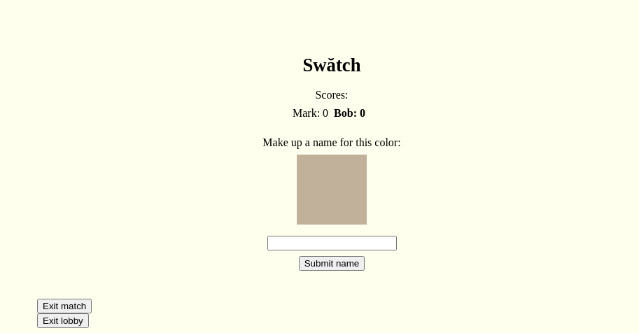

# Swătch

Copyright 2021 Mark T. Tomczak
See LICENSE files for usage permissions.

## About

**Swătch** (a portmanteau of "swatch" and "match") is a game about how we name colors. You and your opponents will identify names of colors, guess a shade based on a name, or try to trick each other into naming a color after a name you chose. See who has the most color insight!

## Running

To run the game locally, install [Node.js](https://nodejs.org/) on your machine, then `npm i` in the project root directory to pull in all dependencies. Then run `npm run start` to build the client and server and launch. The server will run at `http://localhost:8000`.

## Playing

The game can be run locally or is available online at [https://swatch.fixermark.com](https://swatch.fixermark.com).

To start a game, choose your name and click `Enter`. Then either create a match by selecting the number of players and hitting `Create` or by choosing to `Join` an open match. Once enough players have joined, you can hit `Play` to start the game.

Play consists of a number of rounds. There are three types of rounds you will see:

### Guess the color
You will see "Guess the color for" and the name of a color. Choose the shade you think most closely matches that name by clicking on the colored box to open your color picker or by tuning the red, green, blue knobs to choose a color mix.

### Guess the name
You will see "Guess the name for," a box with a color in it, and several potential names. Choose the name that you think is correct for the color.

#### Make up names
You will see "Make up a name for this color" and a box with a color in it. Type in a name that you think might match that color. Once everyone has chosen a name, you will see "Guess the name for" and the list of names players made up, plus the real name of the color. Try to guess the real name separate from the made-up names! You get points for correctly guessing the real name and for every player who guesses your name.

## Developing
The game is built on top of the [boardgame.io](https://boardgame.io/) framework. Local testing can be done via the **Running** process described above. For deployment, you will need a server that can host Node applications. I use [Dreamhost](https://www.dreamhost.com/), but there are many options available. Deployment will depend on the details of your configuration.

I created a series of blog posts about the development of this game, available [on my personal blog](http://fixermark.blogspot.com/search/label/swatch).

## Special Thanks

Credit for seed concept, refinement, and testing goes to the Monday night game group (Valarie Bennett, Brian Gray, Will Haines, Nicole Havranek, Damien Lopez, Brittany McLaughlin, Ben Resnick, Melanie Seigel, and Aaron Tarnow).

Additional testing and concept credit goes to Amanda Leight and Denise Tomczak.

Additional concept credit goes to Mark C. Tomczak for suggesting the guess-name mode.

Color names are based on the Sherwin-Williams paint color names.

Special epithets and insults go to COVID-19, which provided additional isolation time for concept refinement and development but will never receive praise from me.